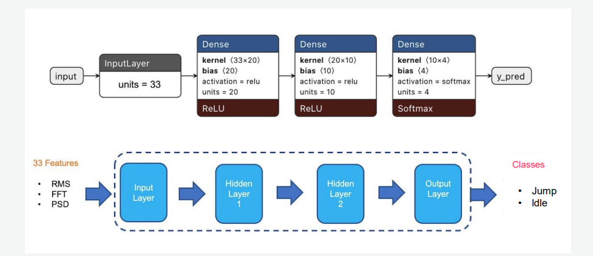

# 📦 AIOT - HCMUS

Develop an AIoT system

[Edge impulse](https://edgeimpulse.com/)

[Plat formIO](https://platformio.org/)

I attempted to utilize a mobile app that assisted with performing physical activities without the use of equipment, but it quickly became boring and I gave up. why don't we do something fun and burn calories at the same time

## 👦 Member

Hoang Huu Minh An - 20127102

## ⛏️ How it work
When the user jumps, a system (Esp32+MPCU6050) is attached to the user's body or held by the user. User actions will be detected based on the accelerometer. EdgeImplulse analyzes the data from the accelerometer and decides whether the user will act normally or jump. If it's a Jump activity the system will simulate keystrokes send to the computer.

## ⚙️ Hardware

[Wifi BLE ESP32 NodeMCU-32S CH340 Ai-Thinker](https://hshop.vn/products/kit-rf-thu-phat-wifi-ble-esp32-nodemcu-32s-ch340-ai-thinker)

[GY-521 6DOF IMU MPU6050](https://hshop.vn/products/cam-bien-6-dof-bac-tu-do-gy-521-mpu6050)

## 🎯 Model

## 🔥 Link demo

Link demo mid:

Link demo final:

